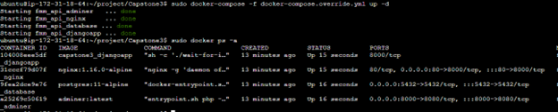

# Capstone Project on Django with Docker, AWS EC2 and Jenkins
### Capstone Project on Django+Docker+AWS+Jenkins

### Project Steps overview:
 - [x] Test Django Project in Local Machine
 - [x] Upload Project from Local Repo to GitHub Repo
 - [x] Create EC2 Ubuntu Instance
 - [x] Install Docker and Docker Compose in EC2
 - [x] Create Docker Images
 - [x] Install Install java
 - [x] Install Jenkins in EC2 and Run
 - [x] Link GitHub with Jenkind (put the Repo link in Jenkins)
 - [x] CI/CD pipeline through Jenkins
<br><br>


## Project Steps:

### 1 Upload Project from Local Git Repo to GitHub Repo
    git add .
    git commit -m "First Commit"
    git push

    GitHub Repo: https://github.com/AcharyaBhattS/Capstone-Django-with-Docker-AWS-Jenkins

### 2. Create EC2 Ubuntu Instance in AWS Cloud

#### Connect EC2 instance from Local System through SSL
    ssh -i <.pem filename> ubuntu@<Public IP>

#### Prepare EC2 Ubuntu Platform as per the project
        mkdir project  <create directory>    
		cd project          
		git clone https://github.com/AcharyaBhattS/Capstone-Django-with-Docker-AWS-Jenkins
		CD Capstone_Django 
             

##  3. Install Docker and Docker Compose on Ubuntu EC2 machine
[Docker Installation Reference](https://docs.docker.com/engine/install/ubuntu/)
###  3.1 Update the apt package index and install packages to allow apt to use a repository over HTTPS:
    sudo apt-get update
	sudo apt-get install \ 
    ca-certificates \ curl \ gnupg
###  3.2 Add Docker’s official GPG key:
    sudo install -m 0755 -d /etc/apt/keyrings
	curl -fsSL https://download.docker.com/linux/ubuntu gpg | 
    sudo gpg --dearmor -o /etc/apt/keyrings/docker.gpg
	sudo chmod a+r /etc/apt/keyrings/docker.gpg
###  3.3 Use the following command to set up the repository:
    echo \ "deb [arch="$(dpkg --print-architecture)" signed-by=/etc/apt/keyrings/docker.gpg] https://download.docker.com/linux/ubuntu \ "$(. /etc/os-release && echo "$VERSION_CODENAME")" stable" | \ 
    sudo tee /etc/apt/sources.list.d/docker.list > /dev/null
###  3.4 Install Docker engine:
    sudo apt-get update
### 3.5 Install Docker Engine, containerd, and Docker Compose.
    sudo apt-get install docker-ce docker-ce-cli containerd.io docker-buildx-plugin docker-compose-plugin 
### 3.6 Verify that the Docker Engine installation is successful by running the hello-world image: 
    sudo docker run hello-world
### 3.7 Install Docker & Docker-compose: 
    sudo snap install docker
    sudo apt  install docker-compose     

### 3.8 Check versions: 
    docker -v
    docker-compose -v

### 3.9 Project specific:
// to be execute from the root folder (project) every time to make Read Write Update attribute set for directory 
    
    sudo chmod -R 776 Capstone3  

Example:
        						
    drwxrwxr-x  3 ubuntu ubuntu 4096 May  7 06:03 ./
	drwxr-x---  5 ubuntu ubuntu 4096 May  7 06:05 ../
	drwxrwxrw- 10 ubuntu ubuntu 4096 May  7 06:03 Capstone3/

### 3.10 UP the Container:
    sudo docker-compose -f docker-compose.override.yml up

### 3.11 To see the details of Container images:
    sudo docker ps -a 

### 3.12 Actual Container Execution Image

<br>

### 3.13 To shutdown/ stop the container:
    sudo docker-compose -f docker-compose.override.yml down
<br>

## 4 Install JAVA & Jenkins on Ubuntu on EC2
[Jenkins Installation Reference](https://www.devstringx.com/setting-up-jenkins-on-amazon-ec2-ubuntu-instance)

### 4.1 Create a Secutity Group
EC2 instance >> Network & Security >> Security Group >> Create a Security Group >> Add Inbound Rules

--> Port 8080 is where Jenkins runs.

    //	SSH 		TCP	22		Custom		CloudIPv4/32	example 52.70.54.92/32
	//	HTTP		TCP	80		Anywhere	0.0.0.0/0
	//	CUSTOM TCP	TCP	8080	Anywhere	0.0.0.0/0

### 4.2 SSH to connect to your instance
    ssh -i kp-project3.pem ubuntu@3.86.28.185

### 4.3 Enable the ‘Universe’ repository using the below command
    sudo add-apt-repository universe

### 4.4 Install java and Update the system
```sh
sudo apt update
sudo apt install openjdk-11-jre
java -version
```
If everyting looks ok the output should be like

```sh
 openjdk version "11.0.12" 2021-07-20 OpenJDK Runtime Environment (build 11.0.12+7-post-Debian-2) OpenJDK 64-Bit Server VM (build 11.0.12+7-post-Debian-2, mixed mode, sharing)
```

### 4.5 Install Jenkins 
```sh
curl -fsSL https://pkg.jenkins.io/debian/jenkins.io.key | sudo tee \   /usr/share/keyrings/jenkins-keyring.asc > /dev/null 
```
and 
```sh
echo deb [signed-by=/usr/share/keyrings/jenkins-keyring.asc] \   https://pkg.jenkins.io/debian binary/ | sudo tee \   /etc/apt/sources.list.d/jenkins.list > /dev/null
```
Install latest update to the system again 
```sh
sudo apt-get update 
```
Time to install Jenkins 
```sh
sudo apt-get install jenkins
```
<br>

## 5. Start Jenkins Procedures 
Enable Jenkins :
```sh
sudo systemctl enable jenkins
```
Start Jenkins :
```sh 
sudo systemctl start jenkins
```
Know the status of the Jenkins whether it is running or not : 
```sh
sudo systemctl status jenkins
```
<br>
<p>The Jenkins usually runs at <strong> Port : 8080</strong> if left unconfigured </br>

<p>Put the public IP assinged by the EC2 instance Dashboard followed by the Port Number to access the Jenkins Dashboard</p>

Now we will dockerize the application in docker hub so that it can be accessed anywhere by anyone.
<br><br>

### Screenshots
[](https://postimg.cc/WhFVSPsq)

[](https://postimg.cc/xcw24Fdx)

<br><br>

## 6. Open a web browser and enter the URL, here you will be asked to enter the admin password.

    //	http://<your_ec2_ip_address>:8080
        http://3.86.28.185:8080
<br>

## 7. Copy the Jenkins admin user password using the below command, and paste it into the “Administrator Password” section on your web browser

    sudo cat /var/lib/jenkins/secrets/initialAdminPassword 
<br>

## 8. Continue with the setup and install suggestive plugins by clicking on the button ‘Install suggested plugins
<br>

## 9. Create your first admin user and click on the button Save and Continue
<br>

## 10. Navigate to <your_ec2_ip_address>:8080 in your web browser and log in with admin credentials setup in step above.

